<h1 align="center">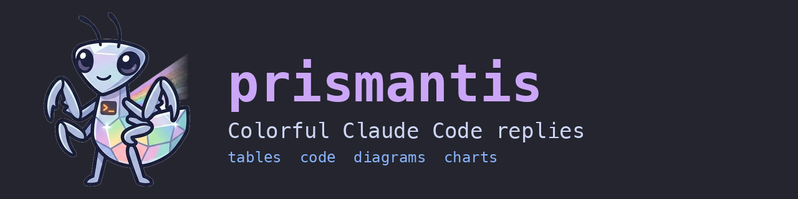</h1>

[](https://github.com/NahumLitvin/prismantis/actions/workflows/ci.yml)

> Sees 16 colors. Your terminal only had 8.

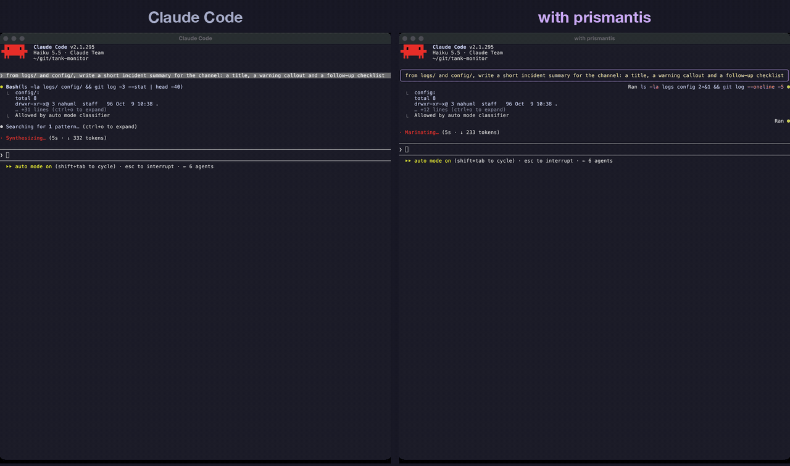

<sub>Same prompt, same model, left plain Claude Code, right with prismantis. The LaTeX scene uses [#50](https://github.com/NahumLitvin/prismantis/pull/50), not released yet.</sub>

## TL;DR

- Claude Code prints mermaid as source and tool calls as walls of text. prismantis draws them: real charts and flowcharts, colored tables and code, and quiet tool rows. Typeset LaTeX math is next, in [#50](https://github.com/NahumLitvin/prismantis/pull/50).
- 15 palettes plus `mono`, and copy buttons on everything.
- Two commands to install, `/plugin` to turn it off. Claude Code's own renderer comes back the moment you do.
- No network calls. The only program it ever runs is the clipboard helper for one-click HTML table copy, and only when you click.

```
/plugin marketplace add NahumLitvin/prismantis
```

```
/plugin install prismantis@prismantis
```

Then run `/prismantis demo` for a tour of the main features.

## Install

Requires Claude Code **2.1.287** or later. Run the two commands above.

To update, run this, then `/reload` in every open session. A session keeps the version it loaded until it reloads.

```bash
claude plugin marketplace update prismantis && claude plugin update prismantis@prismantis
```

To uninstall:

```bash
claude plugin uninstall prismantis@prismantis
```

## Features

| Feature | What you get |
| --- | --- |
| [Themes](#themes) | `/prismantis theme <name>` switches on the spot. 16 themes and 20 color slots you can override |
| [Tables](#tables) | colored headers, rules, column alignment, colored numbers, sized to the terminal |
| [Code](#code) | a language header and copy button, Prism highlighting in two dozen languages, shell lines colored like a prompt |
| [Diagrams and charts](#diagrams-and-charts) | flowcharts, sequence, state, class and ER diagrams, bar and line charts, one color per box, participant and bar |
| [Layout](#layout) | back-to-back tables and diagrams sit side by side and wrap on narrow terminals |
| [Copy buttons](#copy-buttons) | `⧉ md`, `⧉ art` and `⧉ html` on tables, `[ ⧉ copy ]` on code, lists and quotes, `/prismantis copy` without a mouse |
| [Tool rows](#tool-rows) | `Ran gh pr view 12`, `Read ~/src/app.ts`, groups summed up as `Ran 3 commands, read 2 files`, with status dots |
| [Turn footer](#turn-footer) | `✻ Baked for 6m 20s` with the duration in the number color |
| [Slash commands](#slash-commands) | command output (`/cost`, `/context`, plugin commands) gets the same tables and code styling |
| [Diagram hints](#diagram-hints) | a short model-only note on each prompt so Claude reaches for diagrams and charts when they help |
| [Text](#text) | bold, italic, strikethrough, inline code, links, versions, durations, percentages and paths in their own colors |
| [Headings, lists, quotes](#headings-lists-quotes) | 4 heading styles, nested lists, task lists, quotes with an accent bar |
| [Your prompts](#your-prompts) | what you type draws in a bubble, an accent bar or a chevron, so you find your turns when you scroll back |
| [Right to left](#right-to-left) | Hebrew and Arabic read right to left, with bullets, quote bars and table columns mirrored |
| [Other mods](#other-mods) | `$.prismantis.markdown` draws any markdown the way replies are drawn, for mod authors |


### Themes

Dark: `catppuccin-mocha` (default), `dracula`, `nord`, `tokyo-night`, `gruvbox-dark`, `rose-pine`, `everforest`, `github-dark`, `one-dark`, `solarized-dark`.

Light: `catppuccin-latte`, `gruvbox-light`, `rose-pine-dawn`, `github-light`, `solarized-light`.

`mono` drops the palette for bold and dim; alerts keep their colors. Switch with `/prismantis theme nord`, or run `/prismantis` for the help screen with every theme. Every palette is MIT licensed and credited in [THIRD_PARTY_NOTICES.md](docs/THIRD_PARTY_NOTICES.md).

### Tables

Header cells take the `tableHeader` color, and the default `box` style puts a double line under the header. `tableStyle` picks `box` (the default, every cell boxed), `rules`, `grid` or `minimal`. `:---:` and `---:` alignment is honored, numbers in cells get the number color, and columns shrink to fit the terminal.

### Code

Each code block gets a header row: the language on the left, a copy button on the right. The code sits indented below with no frame, so selecting it with the mouse copies only the code.

- **Prism** highlights JavaScript, TypeScript, JSX/TSX, Python, Go, Rust, Java, Kotlin, Swift, C, C++, C#, Ruby, JSON, YAML, TOML, SQL, HTML, CSS, Dockerfile, HCL and diff.
- **Shell** blocks (`bash`, `sh`, `zsh`, `fish`, `powershell`, unlabeled) color the command word, `--flags`, quoted strings and `# comments`, and restart after `|`, `&&` and `;`.

### Diagrams and charts

Code blocks tagged `mermaid` draw as colored text art:

- flowcharts (`graph LR`, `graph TD`, decisions), sequence, state, class and ER diagrams
- bar and line charts with `xychart-beta`, sized to the terminal width
- each box and participant gets its own theme color, the same at both ends of a sequence diagram
- bars in a multi-series chart get their own colors; a single-series chart prints each value above its bar and colors the tallest one
- gridlines stay dim, axis numbers use the number color

Diagrams too wide for the window, or over 80 lines, stay as code. `mermaidAscii` swaps box-drawing characters for `+ - |`. Pie charts are not supported.

### Layout

When tables and diagrams follow each other, they share a row and wrap once the terminal runs out of width. A wide terminal shows a table, a flowchart and two charts side by side.

### Copy buttons

- **Tables:** `⧉ md` copies the original Markdown and `⧉ art` a boxed table that pastes well into Slack. `⧉ html` copies a formatted table (headers, alignment, inline formatting) plus a tab-separated plain-text copy.
- **Code, lists and quotes:** `[ ⧉ copy ]` on each. Code copies without its fences, lists as markdown, quotes without their `> ` markers.
- **Diagrams:** `⧉ source` copies the mermaid code, `⧉ art` the drawn art.
- **Whole replies:** replies with more than one block, or any Hebrew or Arabic, end with `⧉ copy reply`, which copies the reply as Claude wrote it. Selecting right-to-left text on screen copies letters in drawn order, not reading order.
- **No mouse:** `/prismantis copy` copies the last reply, `/prismantis copy code` its last code block.

`⧉ html` shows in a local macOS terminal or a Linux graphical session. macOS needs nothing extra. Linux needs [CopyQ](https://copyq.readthedocs.io/en/stable/installation.html) running (see its [Wayland caveats](https://copyq.readthedocs.io/en/stable/known-issues.html#on-linux-some-features-do-not-work-under-wayland)). On Ubuntu:

```bash
sudo apt install -y copyq && copyq --start-server && copyq config autostart true
```

Clicking works where the terminal passes clicks through, as fullscreen mode does. Terminals with copy-on-select, such as Warp, may grab the word "copy" instead.

### Tool rows

Each tool call draws as one line: a verb and its target, `Ran` with a colored shell command, `Read` and `Edited` with the path. A status dot shows done, running or failed, and output still draws below.

Collapsed groups draw one line too: `Ran 3 commands, read 2 files · last: npm test`, with `· N failed` in the flag color when any call failed. Expand a group (ctrl+o or `--verbose`): shell calls keep their colored command with the output boxed below, and other calls use Claude Code's own rows. ctrl+o on a reply shows the original text.

`toolStyle` keeps tool rows apart from what Claude says:

| `chat` (default) | `tree-dim` | `tree-bold` | `classic` |
|---|---|---|---|
| dimmed on the right, capped at 60% of the width | tucked under the sentence with `⎿`, dimmed | `tree-dim` with one-line sentences in bold | bold verb and status dot, full brightness |
| 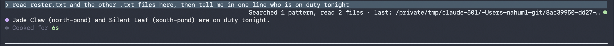 | 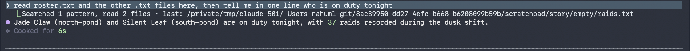 | 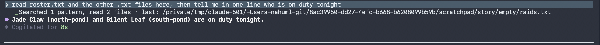 | 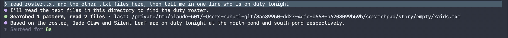 |

### Turn footer

The line that closes a turn keeps Claude Code's word and colors the duration: `✻ Baked for 6m 20s`. Terminal only, since that's the only surface that draws it.

### Slash commands

Output from slash commands, built-in or from other plugins, is drawn like a reply, copy buttons included. Errors keep Claude Code's own red line.

### Diagram hints

Claude rarely writes a chart unless it knows the terminal can draw one. With `diagramHints` on (the default), each prompt you type carries a short note that only the model reads. It says tables, alerts, code, mermaid diagrams and `xychart-beta` charts render here, and asks for commands in fenced blocks, since only those get a copy button.

The note costs about 190 tokens per prompt. It's off whenever `mermaid` is off, and skipped for headless `claude -p` runs and background notifications.

### Text

**Bold**, *italic*, ~~strikethrough~~, `inline code`, links and bare URLs, clickable as terminal hyperlinks. Numbers, versions (`v2.14.0`), durations (`250ms`, `3h`), sizes (`16Gi`) and percentages (`99.9%`) take the number color, and paths like `~/src/app.ts` the path color.

### Headings, lists, quotes

`headingStyle` picks `banner` (the default: a box around H1, a heavy rule under H2), `bold`, `underline` or `uppercase`. Terminals have one font size, so headings stand out through style and color.

Lists keep their numbers and nest with `•` and `◦`. Quotes get an accent bar, and GitHub alerts (`> [!NOTE]`, `[!TIP]`, `[!IMPORTANT]`, `[!WARNING]`, `[!CAUTION]`) draw as colored boxes.

Task lists draw as `[ ]` and `[✓]`, with done items dimmed and struck through. `taskStyle` switches to `ticks` (`○` `✓`), `box` (`□` `✓`) or `progress`, which adds a done-count bar above each list.

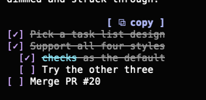

### Your prompts

What you type, at the prompt or through Remote Control, draws in the theme's colors. `promptStyle` picks the look, and `off` keeps Claude Code's own. Task notifications and teammate messages are left alone.

| `bubble` (default) | `bar` | `chevron` |
|---|---|---|
| 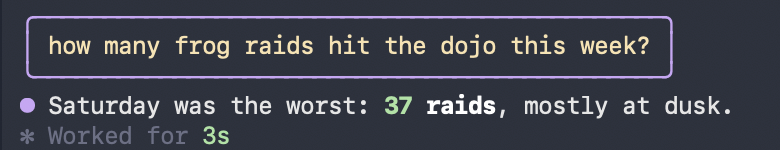 | 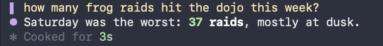 | 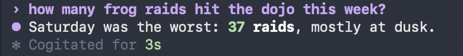 |

### Right to left

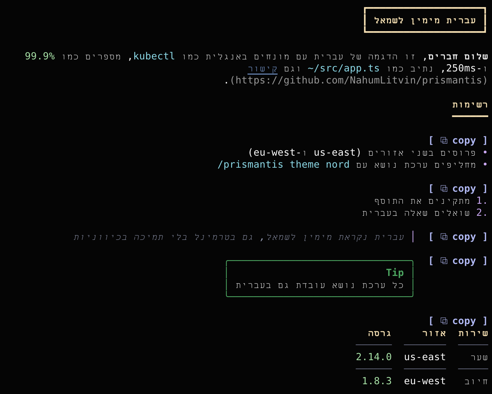

Hebrew and Arabic blocks are right aligned, with bullets, numbers and quote bars on the right and table columns mirrored. Code, numbers, paths and links stay left to right inside them. Terminals treat right-to-left letters differently, so prismantis detects yours and sends the letters the way it needs them. `/prismantis demo-rtl` shows every element, and the `rtl` option forces a terminal's handling or turns it off.

## Configure

Open `/config` and look for the **prismantis** rows, or set values in `~/.claude/settings.json`:

```json
{
  "pluginConfigs": {
    "prismantis@prismantis": {
      "options": {
        "theme": "tokyo-night",
        "tableStyle": "grid",
        "headingStyle": "banner",
        "tableHeaderColor": "#ffcc00",
        "numberColor": "cyan"
      }
    }
  }
}
```

Options sit under `options`, keyed by the plugin's install name. Project settings are not read for plugin options.

| Option | Values | Default |
| --- | --- | --- |
| `enabled` | `true`, `false` | `true` |
| `theme` | see [Themes](#themes) | `catppuccin-mocha` |
| `tableStyle` | `box`, `rules`, `grid`, `minimal` | `box` |
| `taskStyle` | `checks` (`[ ]` `[✓]`, done struck through), `ticks` (`○` `✓`), `box` (`□` `✓`), `progress` (ticks with a done-count bar) | `checks` |
| `promptStyle` | `bubble`, `bar`, `chevron`, `off` | `bubble` |
| `headingStyle` | `banner`, `bold`, `underline`, `uppercase` | `banner` |
| `highlightNumbers` | `true`, `false` | `true` |
| `highlightPaths` | `true`, `false` | `true` |
| `toolRows` | `true`, `false` | `true` |
| `toolStyle` | `chat`, `tree-dim`, `tree-bold`, `classic` | `chat` |
| `copyButtons` | `true`, `false` | `true` |
| `diagramHints` | `true`, `false` | `true` |
| `rtl` | `auto`, a terminal (`warp`, `kitty`, `apple-terminal`, `iterm`, `ghostty`, `wezterm`, `vscode`, `alacritty`, `windows-terminal`, `gnome`, `konsole`), `off` | `auto` |
| `mermaid` | `true`, `false` | `true` |
| `mermaidAscii` | `true`, `false` | `false` |
| `<token>Color` | any color, see below | theme |

A color is hex (`#a6e3a1`, `#fc0`), `rgb(166,227,161)`, `ansi256(114)` or a name (`green`, `cyanBright`). Values that don't parse are ignored. Every token has a `<token>Color` option and a row in `/config`:

| Token | Colors |
| --- | --- |
| `accent` | reply bullet, H3+ headings, quote bar, running tool dots |
| `heading` | H1 and H2 |
| `strong` | **bold** text |
| `emphasis` | *italic* text, variables, attribute names |
| `inlineCode` | `inline code` |
| `codeText` | code block text |
| `codeCommand` | shell commands, functions, class names, keys |
| `codeFlag` | `--flags`, keywords, failures |
| `codeString` | strings |
| `codeComment` | comments, the code block's language label |
| `link` | links, URLs, properties, tags |
| `path` | file paths, regexes |
| `number` | numbers, versions, durations, done dots |
| `quote` | quote text |
| `rule` | rules, chart gridlines |
| `tableHeader` | table header cells |
| `tableRule` | table rules |
| `bullet` | list bullets and numbers |
| `diagram` | diagram lines |
| `diagramText` | diagram labels |

## Troubleshooting

- **A setting or update didn't take:** run `/reload`. A session keeps what it loaded.
- **A diagram shows as code:** its source is over 80 lines or 8,000 characters, it's wider than the window, it doesn't parse, or `mermaid` is off. Widen the terminal or split the diagram.
- **No `⧉ html` on tables:** you're over SSH, in the desktop app or VS Code, or on Linux with no graphical session. `⧉ md` and `⧉ art` still work.
- **`⧉ html` copied plain text only:** CopyQ isn't running, or the clipboard helper failed. The toast says why.
- **Clicking a copy button selects the word "copy":** your terminal copies on select. Use `/prismantis copy`.

## Limits

- The parser covers what Claude writes (headings, lists, tables, fences, quotes, emphasis, links). It's not full CommonMark: nested quotes and HTML draw as plain text.
- Widths count CJK and emoji as two columns. Terminals disagree on a few emoji, so those can still be off by one.
- Languages outside the 24 above draw in `codeText`.
- Tested by hand in the macOS terminal; CI runs the tests on macOS, Linux and Windows. The desktop app, VS Code and mobile use the same mod API but are not checked by hand yet.

<details>
<summary>For LLMs and agents</summary>

To change the code, read [AGENTS.md](AGENTS.md) instead.

- **What it is:** a Claude Code mod (function hooks in TypeScript) that redraws assistant replies, slash-command output, tool rows, the turn footer and user prompts. It changes how things look. The one thing it sends the model is the optional diagram hint below.
- **Install:** `/plugin marketplace add NahumLitvin/prismantis`, then `/plugin install prismantis@prismantis`. Needs Claude Code 2.1.287+. Changes apply after `/reload`.
- **Configure:** `/prismantis theme <name>` is the only setter at runtime. Every other option is a key under `pluginConfigs["prismantis@prismantis"].options` in `~/.claude/settings.json` (or a row in `/config`), then `/reload`. Options and defaults are in the [Configure](#configure) table; the machine-readable source is `userConfig` in [.claude-plugin/plugin.json](.claude-plugin/plugin.json). Color values that don't parse are ignored.
- **Side effects:** no network. The only program it runs is the `⧉ html` clipboard helper: `/usr/bin/osascript` on macOS, `copyq` on Linux, 5 second timeout, only when the user presses the button. With `diagramHints` on, it adds about 190 tokens of model-only context to each typed prompt.
- **Turning it off:** `"enabled": false`, or disable the plugin in `/plugin`.
- **For other mods:** `$.prismantis.markdown({ surface, text, columns })`, typed in [types/index.d.ts](types/index.d.ts). See [Other mods](#other-mods).

</details>

## Roadmap

Planned features are on the [roadmap board](https://github.com/users/NahumLitvin/projects/2), one issue each. Give an issue a 👍 to vote for it, or open one for what you miss.

## Develop

```bash
git clone https://github.com/NahumLitvin/prismantis
claude --plugin-dir ./prismantis
```

Edits hot-reload in that session. Before a PR run `claude plugin validate .` and `claude plugin test .`, and print [docs/demo.md](docs/demo.md) to check the look. `npm --prefix scripts run bench` times a full render of the demo reply, so speed claims can be checked on any machine. CI also type-checks, rebuilds the vendored bundles byte for byte and installs from a clean config. See [CONTRIBUTING.md](.github/CONTRIBUTING.md) and [AGENTS.md](AGENTS.md).

### Other mods

Other mods can draw markdown in the user's theme with `$.prismantis.markdown`. Pass the surface, the text and the content width in columns.

- It answers the tree to draw, or `undefined` when prismantis is disabled or the text holds nothing to draw.
- It throws when prismantis isn't installed, so call it in a `try`.
- Prismantis draws at least 20 columns wide. Copy buttons are left out, because a button can't cross from one mod to another.

```tsx
let drawn
try {
  drawn = await $.prismantis.markdown({ surface: e.surface, text, columns: e.props.bodyColumns })
} catch {}
return drawn ?? <Markdown text={text} />
```

The types are in [types/index.d.ts](types/index.d.ts). List prismantis under `dependencies` in your `plugin.json` and Claude Code lays them into your `.claude-plugin/types/`. When prismantis is optional, declare the noun in your own contract instead:

```ts
declare module 'claude-code' {
  interface EngineInterface {
    prismantis: {
      markdown: (args: { surface: RenderSurface; text: string; columns: number }) => Promise<RenderElement | undefined>
    }
  }
}
```

## Author

Built by [Nahum Litvin](https://github.com/NahumLitvin), who writes about running untrusted code in production at [catchkill9.dev](https://www.catchkill9.dev/).

## License

[MIT](LICENSE). Bundled third-party code is listed in [THIRD_PARTY_NOTICES.md](docs/THIRD_PARTY_NOTICES.md).
